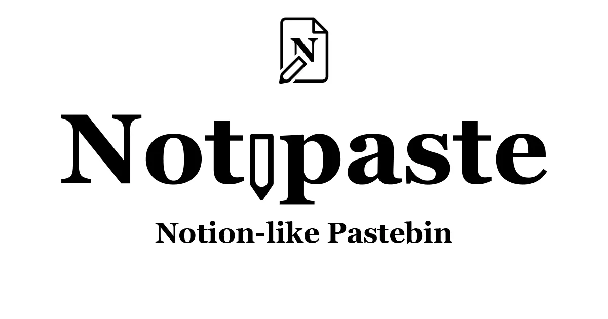

# Notipaste

Notipaste is a Notion-like block styled pastebin built using Next.js and Pocketbase.

## Motivation

The main reason why I created Notipaste is because I want to learn more about Pocketbase.  
But I don't want to create a project that won't be used, at least by me.  
So I decided to create a pastebin, because I use pastebin a lot to share or save my code snippets.

## About uptime

The database are hosted on my own PC.  
I'll try my best to keep it online 24/7, but there will be some downtime for couple minutes if I need to restart my PC.  
If the server down for more than 30 minutes, it probably because there is a power outage in my area. Please try again in couple hours.

## Features

- Notion-like block styled editor
- Syntax highlighting (BUG: Syntax highlighting doesn't render correctly on read mode)
- Media support (Image, Video, and Embed)
- Light and dark theme
- Guest user
  - Create paste (Only lasts for 14 days)
  - Delete paste with provided token
  - Add image from URL
- Authenticated user
  - Create paste (Permanent)
  - Edit paste
  - Delete paste
  - Set paste visibility (Public, Private)
  - Protect paste with password
  - Set paste expiration (Never, 1 day, 7 days, 14 days, 30 days)
  - Upload image to paste (Max file size: 5 MB)

## Future plans

- [ ] Fix the syntax highlighting (Still waiting from Yopta-Editor creator)
- [ ] Support for video / file upload?  
       **Note**: I'm not sure if I want to support this, because I don't want to host a lot of files on my PC.
- [ ] Status page

## Development / Self-hosting

### Requirements

- Node.js 18.x or later
- Package manager (npm, yarn, pnpm, etc.)
- Pocketbase

### Setup

1. Clone this repository  
   `git clone`
2. Install dependencies  
   `npm install` or `yarn` or `pnpm install`
3. Create `.env.local` file  
   `cp .env.local.example .env.local`
4. Replace `.env.local` variables
5. Run Pocketbase server  
   `pocketbase serve`
6. [Import Pocketbase tables](#import-pocketbase-schema)
7. Run development server  
   `npm run dev` or `yarn dev` or `pnpm dev`

### Environment variables

| Variable name                 | Description                                                                          |
| ----------------------------- | ------------------------------------------------------------------------------------ |
| `NEXT_PUBLIC_POCKETBASE_URL`  | Pocketbase API URL (Default `localhost:8090`)                                        |
| `POCKETBASE_EMAIL`            | Pocketbase Admin email                                                               |
| `POCKETBASE_PASSWORD`         | Pocketbase Admin password                                                            |
| `NEXT_PUBLIC_FACEBOOK_APP_ID` | Facebook Application ID, for facebook share button                                   |
| `NEXT_PUBLIC_ENCRYPTION_KEY`  | Encryption key for encrypting paste password, must be 16 characters long             |
| `NEXT_PUBLIC_VERCEL_URL`      | Your deployment url, somehow vercel deployment can't access this.                    |
| `VERCEL_URL`                  | Vercel URL (Default `localhost:3000` on dev, and generated deployment URL on Vercel) |

### Import Pocketbase schema

1. Go to Pocketbase admin page  
   `http://localhost:8090/admin`
2. Login with your Pocketbase admin account
3. Open `Settings` page
4. Open `Import collections` menu
5. Click `Load from JSON file` button
6. Select `pocketbase-schema.json` file from `db/schema.json` directory

## License

[MIT](LICENSE.md)
